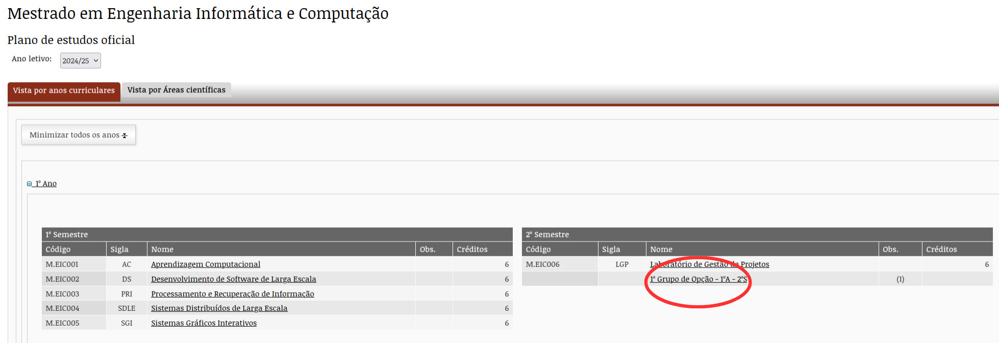
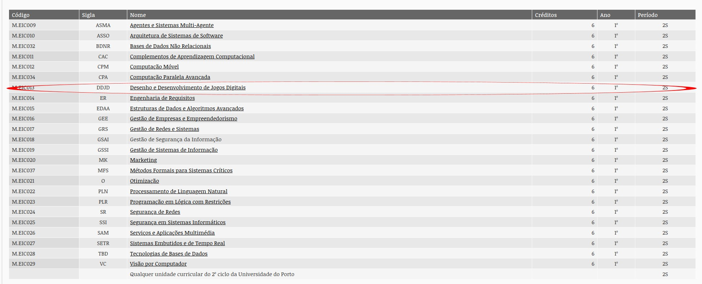
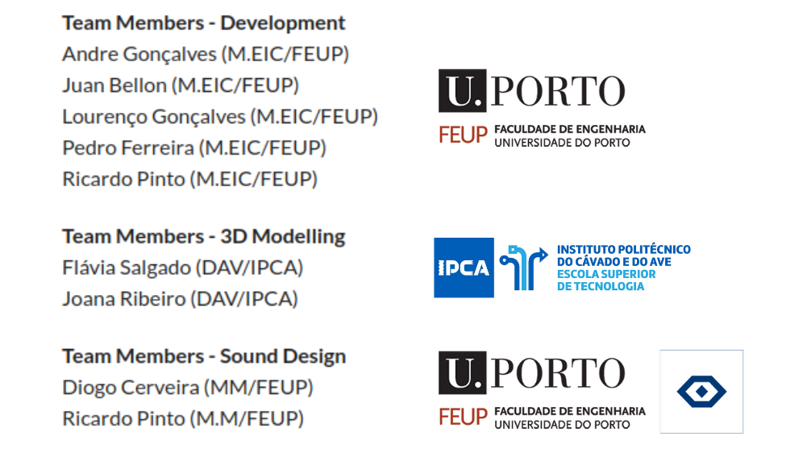
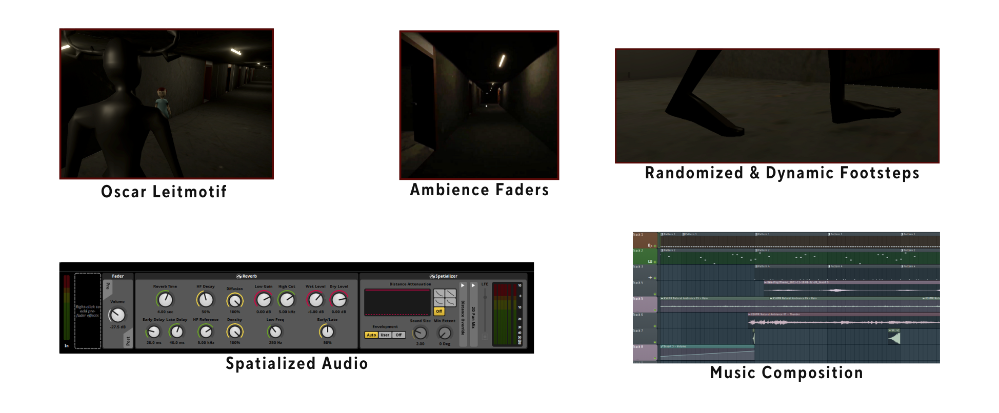

[comment]: # (This presentation was made with markdown-slides)
[comment]: # (This is a CommonMark compliant comment. It will not be included in the presentation.)
[comment]: # (Compile this presentation with the command below)
[comment]: # (mdslides presentation.md --include media)

[comment]: # (Set the theme:)
[comment]: # (THEME = night)
[comment]: # (CODE_THEME = base16/zenburn)
[comment]: # (The list of themes is at https://revealjs.com/themes/)
[comment]: # (The list of code themes is at https://highlightjs.org/)

[comment]: # "You can also use quotes instead of parenthesis"
[comment]: # 'Single quotes work too'
[comment]: # "THEME = white"

[comment]: # (Pass optional settings to reveal.js:)
[comment]: # (controls: true)
[comment]: # (keyboard: true)
[comment]: # (markdown: { smartypants: true })
[comment]: # (hash: false)
[comment]: # (respondToHashChanges: false)
[comment]: # (Other settings are documented at https://revealjs.com/config/)

# Semana Profissão Engenheiro 2025

## GIG (DDJD) | Abril 2025

Pedro Ferreira 
MSc in Informatics and Computing Engineering Student @ FEUP 

[comment]: # (!!! data-auto-animate data-background-video="media/videos/background-video.mp4", data-background-video-loop data-background-video-muted data-background-opacity="0.2")

Bem-vindos à FEUP!

[comment]: # (!!! data-auto-animate data-background-video="media/videos/background-video.mp4", data-background-video-loop data-background-video-muted data-background-opacity="0.2")

Bem-vindos à FEUP!

- Quem gosta de jogar videojogos?

[comment]: # (!!! data-auto-animate data-background-video="media/videos/background-video.mp4", data-background-video-loop data-background-video-muted data-background-opacity="0.2")

Bem-vindos à FEUP!

- Quem gosta de jogar videojogos?

- Quem gosta/gostaria de fazer videojogos?

[comment]: # (!!! data-auto-animate data-background-video="media/videos/background-video.mp4", data-background-video-loop data-background-video-muted data-background-opacity="0.2")

A FEUP é o sítio certo para o fazer! ✅

[comment]: # (||| data-auto-animate data-background-video="media/videos/background-video.mp4", data-background-video-loop data-background-video-muted data-background-opacity="0.2")

A FEUP é o sítio certo para o fazer! ✅

[comment]: # (!!! data-auto-animate data-background-video="media/videos/background-video.mp4", data-background-video-loop data-background-video-muted data-background-opacity="0.2")

# Walkthrough até DDJD

## PROG

<iframe width="560" height="315" src="media/videos/Proj_PROG.webm" muted frameborder="0" allow="accelerometer; autoplay; clipboard-write; encrypted-media; gyroscope; picture-in-picture" allowfullscreen></iframe>

[comment]: # (!!! data-auto-animate data-background-video="media/videos/background-video.mp4", data-background-video-loop data-background-video-muted data-background-opacity="0.2")

# Walkthrough até DDJD

## SGI

<iframe width="560" height="315" src="media/videos/Proj_SGI.mp4" muted frameborder="0" allow="accelerometer; autoplay; clipboard-write; encrypted-media; gyroscope; picture-in-picture" allowfullscreen></iframe>

[comment]: # (!!! data-auto-animate data-background-video="media/videos/background-video.mp4", data-background-video-loop data-background-video-muted data-background-opacity="0.2")

# DDJD (Preliminary Project)

<iframe width="560" height="315" src="media/videos/DDJD-PP-G02- FEUPlings- The escape from corridor B_ Final version.mp4" muted frameborder="0" allow="accelerometer; autoplay; clipboard-write; encrypted-media; gyroscope; picture-in-picture" allowfullscreen></iframe>

[comment]: # (!!! data-auto-animate data-background-video="media/videos/background-video.mp4", data-background-video-loop data-background-video-muted data-background-opacity="0.2")

	DDJD (Final Project)

- Projeto multi-disciplinar, com estudantes de outros cursos.

    

[comment]: # (||| data-auto-animate data-background-video="media/videos/background-video.mp4", data-background-video-loop data-background-video-muted data-background-opacity="0.2")

# DDJD (Final Project)

Modelação 3D

<iframe width="560" height="315" src="media/videos/3D_Modelling.mp4" muted frameborder="0" allow="accelerometer; autoplay; clipboard-write; encrypted-media; gyroscope; picture-in-picture" allowfullscreen></iframe>

[comment]: # (||| data-auto-animate data-background-video="media/videos/background-video.mp4", data-background-video-loop data-background-video-muted data-background-opacity="0.2")

# DDJD (Final Project)

Sistema de som & Design de áudio

    

[comment]: # (!!! data-auto-animate data-background-video="media/videos/background-video.mp4", data-background-video-loop data-background-video-muted data-background-opacity="0.2")

# DDJD (Final Project)

Feature ou Bug?

<iframe width="560" height="315" src="media/videos/Echoes_Of_Oscar_Bugs.mp4" muted frameborder="0" allow="accelerometer; clipboard-write; encrypted-media; gyroscope; picture-in-picture" allowfullscreen></iframe>

[comment]: # (!!! data-auto-animate data-background-video="media/videos/background-video.mp4", data-background-video-loop data-background-video-muted data-background-opacity="0.2")

Feature ou Bug? (Pt. II)

<iframe width="560" height="315" src="media/videos/Echoes_Of_Oscar_Bugs_2.mp4" muted frameborder="0" allow="accelerometer; clipboard-write; encrypted-media; gyroscope; picture-in-picture" allowfullscreen></iframe>

[comment]: # (!!! data-auto-animate data-background-video="media/videos/background-video.mp4", data-background-video-loop data-background-video-muted data-background-opacity="0.2")

# DDJD (Final Project)

Versão final (trailer)

<iframe width="560" height="315" src="media/videos/DDJD-FP-D-video.mp4" frameborder="0" allow="accelerometer; clipboard-write; encrypted-media; gyroscope; picture-in-picture" allowfullscreen></iframe>

[comment]: # (!!! data-auto-animate data-background-video="media/videos/background-video.mp4", data-background-video-loop data-background-video-muted data-background-opacity="0.2")

# Questões?

[comment]: # (!!! data-auto-animate data-background-video="media/videos/background-video.mp4", data-background-video-loop data-background-video-muted data-background-opacity="0.2")

# Referências

<a id="1">[1]</a> Vídeo background: Alasabyss (2024) Download Trendy Gaming Technology background with glowing green and blue neon light beams. stylish futuristic tech animation with copy space. full HD and looping motion background. for Free, Vecteezy. Available at: https://www.vecteezy.com/video/49102477-trendy-gaming-technology-background-with-glowing-green-and-blue-neon-light-beams-stylish-futuristic-tech-animation-with-copy-space-full-hd-and-looping-motion-background (Accessed: 24 March 2025).

[comment]: # (!!! data-auto-animate data-background-video="media/videos/background-video.mp4", data-background-video-loop data-background-video-muted data-background-opacity="0.2")

# Obrigado!

<!-- [comment]: # (!!! data-auto-animate data-background-video="media/videos/background-video.mp4", data-background-video-loop data-background-video-muted data-background-opacity="0.2") -->